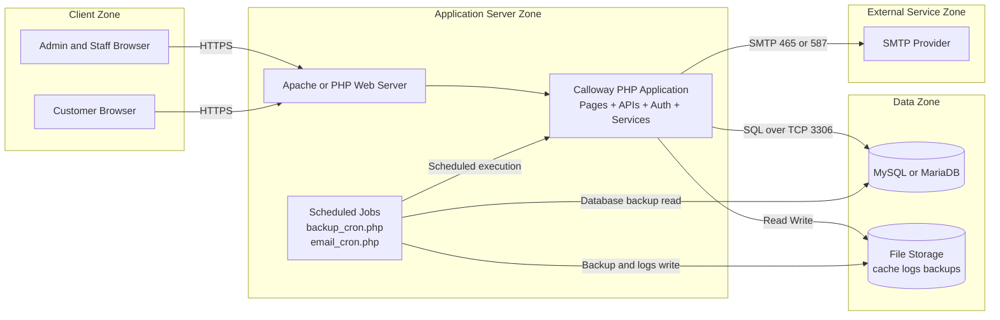
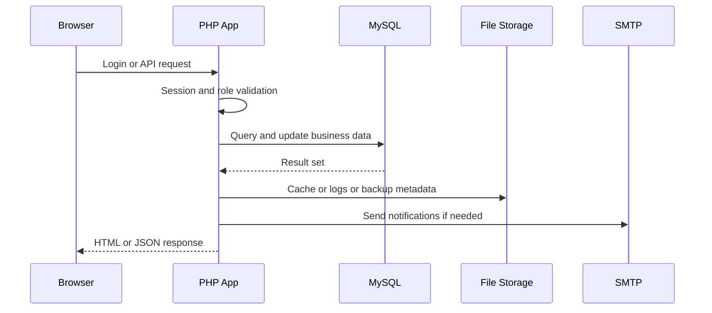

# Calloway Pharmacy IMS - System Architecture (Thesis Version)

## 1. Architectural Positioning

This figure is intentionally a deployment/runtime architecture, not a system design decomposition.

- `System Design` explains functional modules and process logic.
- `System Architecture` explains runtime nodes, network boundaries, interfaces, and infrastructure dependencies.

## 2. Deployment Architecture (Primary Thesis Figure)

## 3. Runtime Interaction View

## 4. Why This Is Different from System Design

This architecture view focuses on non-functional structure:
- Runtime nodes (browser, web server, application process, database, SMTP).
- Trust and network boundaries (client zone, app zone, data zone, external zone).
- Technical interfaces/protocols (HTTPS, SQL/TCP, SMTP).
- Operational workloads (cron execution and backup pipelines).

This avoids repeating module-level flow already covered by your system design figure.

## 5. Concrete Mapping to Your Codebase

- Web entry and routing: `index.php`, `login.php`, `dashboard.php`, `onlineordering.php`, `inventory_management.php`
- API surface: `inventory_api.php`, `notification_api.php`, `api_orders.php`, `api_settings.php`
- Security and auth runtime: `Security.php`, `Auth.php`, `CSRF.php`
- Data access: `db_connection.php`
- Background jobs: `backup_cron.php`, `email_cron.php`
- Service integrations: `email_service.php`, `BackupManager.php`, `CacheManager.php`, `ActivityLogger.php`

## 6. Suggested Thesis Caption

**Figure X. System Architecture of the Calloway Pharmacy IMS.**
The diagram shows deployment nodes, runtime communication paths, and infrastructure dependencies, including web clients, PHP application server, MySQL/MariaDB datastore, file storage, SMTP integration, and scheduled background jobs.
