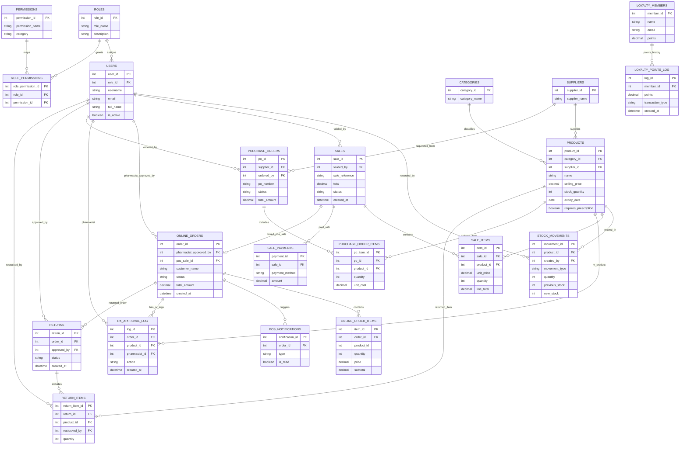

# Calloway Pharmacy - Database ER Diagram (Live Schema)

```mermaid
erDiagram
    ROLES {
        int role_id PK
        string role_name
        string description
    }

    USERS {
        int user_id PK
        int role_id FK
        string username
        string email
        string full_name
        boolean is_active
    }

    PERMISSIONS {
        int permission_id PK
        string permission_name
        string category
    }

    ROLE_PERMISSIONS {
        int role_permission_id PK
        int role_id FK
        int permission_id FK
    }

    CATEGORIES {
        int category_id PK
        string category_name
    }

    SUPPLIERS {
        int supplier_id PK
        string supplier_name
    }

    PRODUCTS {
        int product_id PK
        int category_id FK
        int supplier_id FK
        string name
        decimal selling_price
        int stock_quantity
        date expiry_date
        boolean requires_prescription
    }

    STOCK_MOVEMENTS {
        int movement_id PK
        int product_id FK
        int created_by FK
        string movement_type
        int quantity
        int previous_stock
        int new_stock
    }

    SALES {
        int sale_id PK
        int voided_by FK
        string sale_reference
        decimal total
        string status
        datetime created_at
    }

    SALE_ITEMS {
        int item_id PK
        int sale_id FK
        int product_id FK
        decimal unit_price
        int quantity
        decimal line_total
    }

    SALE_PAYMENTS {
        int payment_id PK
        int sale_id FK
        string payment_method
        decimal amount
    }

    ONLINE_ORDERS {
        int order_id PK
        int pharmacist_approved_by FK
        int pos_sale_id FK
        string customer_name
        string status
        decimal total_amount
        datetime created_at
    }

    ONLINE_ORDER_ITEMS {
        int item_id PK
        int order_id FK
        int product_id
        int quantity
        decimal price
        decimal subtotal
    }

    POS_NOTIFICATIONS {
        int notification_id PK
        int order_id FK
        string type
        boolean is_read
    }

    RX_APPROVAL_LOG {
        int log_id PK
        int order_id FK
        int product_id FK
        int pharmacist_id FK
        string action
        datetime created_at
    }

    PURCHASE_ORDERS {
        int po_id PK
        int supplier_id FK
        int ordered_by FK
        string po_number
        string status
        decimal total_amount
    }

    PURCHASE_ORDER_ITEMS {
        int po_item_id PK
        int po_id FK
        int product_id FK
        int quantity
        decimal unit_cost
    }

    RETURNS {
        int return_id PK
        int order_id FK
        int approved_by FK
        string status
        datetime created_at
    }

    RETURN_ITEMS {
        int return_item_id PK
        int return_id FK
        int product_id FK
        int restocked_by FK
        int quantity
    }

    LOYALTY_MEMBERS {
        int member_id PK
        string name
        string email
        decimal points
    }

    LOYALTY_POINTS_LOG {
        int log_id PK
        int member_id FK
        decimal points
        string transaction_type
        datetime created_at
    }

    ROLES ||--o{ USERS : assigns
    ROLES ||--o{ ROLE_PERMISSIONS : grants
    PERMISSIONS ||--o{ ROLE_PERMISSIONS : maps

    CATEGORIES ||--o{ PRODUCTS : classifies
    SUPPLIERS ||--o{ PRODUCTS : supplies

    PRODUCTS ||--o{ STOCK_MOVEMENTS : moved_in
    USERS ||--o{ STOCK_MOVEMENTS : recorded_by

    SALES ||--o{ SALE_ITEMS : contains
    PRODUCTS ||--o{ SALE_ITEMS : sold_as
    SALES ||--o{ SALE_PAYMENTS : paid_with
    USERS ||--o{ SALES : voided_by

    ONLINE_ORDERS ||--o{ ONLINE_ORDER_ITEMS : contains
    ONLINE_ORDERS ||--o{ POS_NOTIFICATIONS : triggers
    USERS ||--o{ ONLINE_ORDERS : pharmacist_approved_by
    SALES ||--o| ONLINE_ORDERS : linked_pos_sale

    ONLINE_ORDERS ||--o{ RX_APPROVAL_LOG : has_rx_logs
    PRODUCTS ||--o{ RX_APPROVAL_LOG : rx_product
    USERS ||--o{ RX_APPROVAL_LOG : pharmacist

    SUPPLIERS ||--o{ PURCHASE_ORDERS : requested_from
    USERS ||--o{ PURCHASE_ORDERS : ordered_by
    PURCHASE_ORDERS ||--o{ PURCHASE_ORDER_ITEMS : includes
    PRODUCTS ||--o{ PURCHASE_ORDER_ITEMS : ordered_item

    ONLINE_ORDERS ||--o{ RETURNS : returned_order
    USERS ||--o{ RETURNS : approved_by
    RETURNS ||--o{ RETURN_ITEMS : includes
    PRODUCTS ||--o{ RETURN_ITEMS : returned_item
    USERS ||--o{ RETURN_ITEMS : restocked_by

    LOYALTY_MEMBERS ||--o{ LOYALTY_POINTS_LOG : points_history
```
